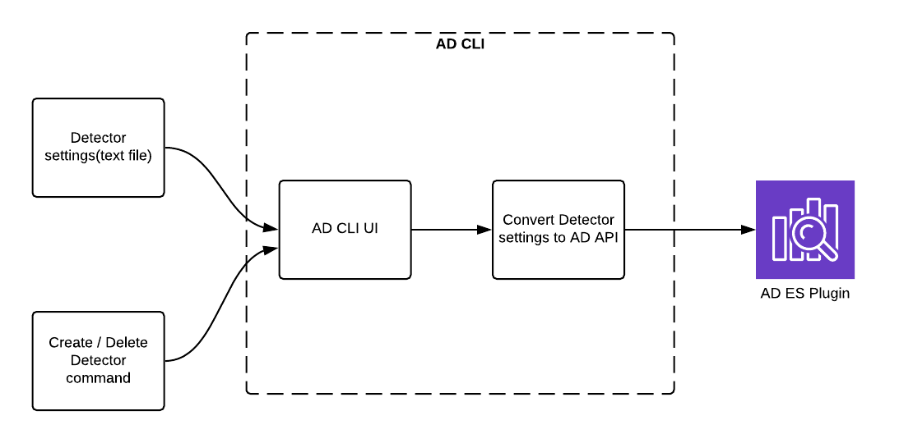
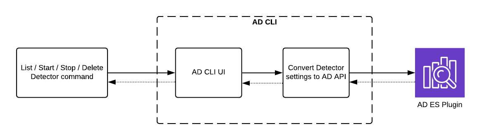

# RFC: Anomaly Detection CLI

### JUNE 2020

### Introduction

Anomaly detection is a technique used to identify unexpected behavior that does not follow expected pattern called outliers. The [anomaly detection plugin](https://github.com/opendistro-for-elasticsearch/anomaly-detection) makes it easy to detect anomalies in time series data stored in Elasticsearch in near real-time using the Random Cut Forest (RCF) algorithm. The [anomaly detection kibana plugin](https://github.com/opendistro-for-elasticsearch/anomaly-detection-kibana-plugin) lets user to set up this job by creating detectors for given index. Though kibana provides ease of use in setting up this job, especially to beginners, a simple CLI command can easily adjust configurations for a large group of detectors in a scalable way. For a common task, user might repeat certain steps within kibana manually, where user can create a script with few lines of command and it will do the same work quicker than kibana.

This RFC proposes a design for a command line tool to give our users an option to create Anomaly detection configurations without having to open Kibana UI.Users can leverage CLI to perform CRUD operations to set up anomaly detection without the need to go through series of steps in UI. This CLI will be built on top of [anomaly detection plugin](https://github.com/opendistro-for-elasticsearch/anomaly-detection) by transforming user input into [anomaly detection api](https://opendistro.github.io/for-elasticsearch-docs/docs/ad/api/) based on commands. This will significantly improve the operations and developer productivity in managing AD for large number of indexes with various settings.

### AD CLI

AD CLI aims at providing basic functionalities like create, update, delete, start, stop detectors in simple commands. This CLI provides greater flexibility of use. User can use CLI to easily do things that are difficult or sometimes impossible to do with kibana UI. This doesn’t use any additional  system resources to load any of graphical part, thus making it simpler and faster than UI. 

### Architecture

The AD CLI is an add-on to the Anomaly Detection. Hence, it is imperative that ES cluster has already installed the AD plugin. AD CLI acts like a wrapper which helps user to easily interact with Anomaly Detection plugin.

1. **Create/Update AD Configuration**

      It is possible to represent the AD configuration settings found in kibana in a text format. This will help users to store configurations in source control tools, so that one can track history of configurations and share across users. User may also want to copy detectors across domains or stages ( dev/staging/prod) for testing. This CLI will accept the detector settings in a text file, convert the user request into [anomaly detection api](https://opendistro.github.io/for-elasticsearch-docs/docs/ad/api/) and execute those REST calls to create or update detectors for given cluster or domain

 
2. **Start/Stop/List/Delete Detectors**

   Few operations like start, stop, list and delete detector(s) can also be performed using AD CLI

**CRUD operation is just a beginning for AD CLI. We can easily identify common use-cases from users which involves multiple operations with AD plugin like copy, export, import , etc... can be easily extracted into commands and be available to the users in multiple releases.**

### Request for Comments:

We would like comments and feedback on the proposal for building AD CLI tool [here](https://github.com/opendistro-for-elasticsearch/anomaly-detection/issues/186). Some specific questions we’re seeking feedback include

* Would you like to provide Detector settings for create/update detector in YAML or JSON format?
* Would you like to see every feature available in kibana to be available in CLI or would you prefer only features which are difficult and impossible to do in UI to be available.
* What function you want for the CLI tool? What’s your use case?

